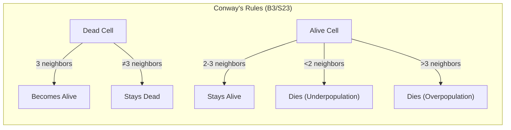
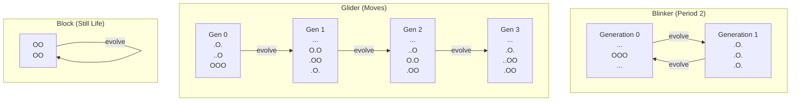
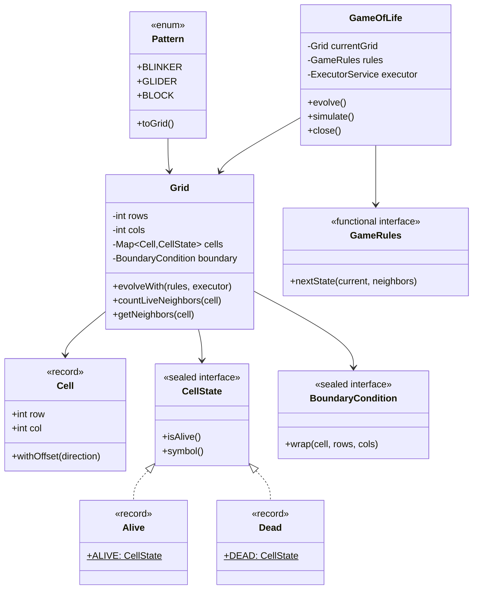
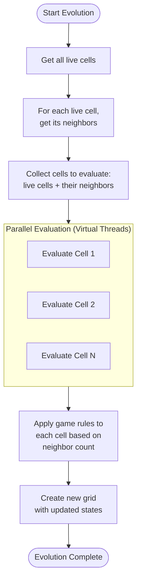

# Conway's Game of Life

[](https://github.com/kousen/gameoflife/actions/workflows/ci.yml)
[](https://sonarcloud.io/summary/new_code?id=kousen_gameoflife)
[](https://sonarcloud.io/summary/new_code?id=kousen_gameoflife)
[](https://sonarcloud.io/summary/new_code?id=kousen_gameoflife)
[](https://openjdk.org/projects/jdk/25/)
[](https://opensource.org/licenses/MIT)

A modern, object-oriented implementation of Conway's Game of Life using Java 25 features including virtual threads, pattern matching, sealed types, and text blocks.

## Features

### Core Game Features
- **Conway's Rules**: Standard Game of Life rules (B3/S23)
- **Alternative Rules**: Support for variants like HighLife (B36/S23)
- **Boundary Conditions**: Fixed, Toroidal (wrapping), and Infinite grid support
- **Predefined Patterns**: Blinker, Glider, Block, Beacon, Toad, Pulsar, and Gosper Glider Gun
- **Custom Patterns**: Load patterns from text strings
- **Parallel Evolution**: Uses virtual threads for efficient multi-core processing

### Conway's Rules Visualization



### Java 25 Features Used
- **Virtual Threads**: For parallel cell evolution (`Executors.newVirtualThreadPerTaskExecutor()`)
- **Pattern Matching**: Enhanced switch expressions with pattern matching for sealed types
- **Sealed Interfaces**: `CellState` and `BoundaryCondition` hierarchies
- **Records**: Immutable data carriers for `Cell` and state implementations
- **Text Blocks**: Multi-line string literals for pattern definitions
- **Enhanced Switch**: Modern switch expressions with multiple case labels

## Project Structure

```
gameoflife/
├── build.gradle.kts                  # Gradle Kotlin DSL configuration
├── settings.gradle.kts               # Gradle settings
├── README.md                         # This file
└── src/
    ├── main/java/com/example/gameoflife/
    │   ├── Cell.java                # Cell coordinate record
    │   ├── CellState.java           # Sealed interface for cell states
    │   ├── Direction.java           # Neighbor direction enumeration
    │   ├── BoundaryCondition.java   # Sealed interface for grid boundaries
    │   ├── Grid.java                # Game grid with cell management
    │   ├── GameRules.java           # Functional interface for rule sets
    │   ├── Pattern.java             # Predefined patterns
    │   ├── GameOfLife.java          # Main game engine
    │   └── Main.java                # Demo application
    └── test/java/com/example/gameoflife/
        ├── CellStateTest.java
        ├── CellTest.java
        ├── DirectionTest.java
        ├── BoundaryConditionTest.java
        ├── GridTest.java
        ├── GameOfLifeTest.java
        └── PatternTest.java

```

## Requirements

- Java 25 or higher
- Gradle 9.0 or higher

## Building the Project

```bash
# Clone or download the project
cd gameoflife

# Compile the project
./gradlew clean build

# Run tests
./gradlew test

# Package as JAR
./gradlew jar

# Run the main demo
./gradlew run

# Run specific patterns
./gradlew runBlinker
./gradlew runGlider
```

## Usage Examples

### Basic Usage

```java
// Create a grid with a pattern
var grid = Pattern.GLIDER.toGrid();

// Create game instance (auto-closeable)
try (var game = new GameOfLife(grid)) {
    // Evolve one generation
    game.evolve();
    
    // Evolve multiple generations
    game.evolve(10);
    
    // Get current state
    var currentGrid = game.getCurrentGrid();
    System.out.println(currentGrid);
}
```

### Pattern Examples



### Custom Patterns

```java
// Define pattern with text block
var pattern = """
    .O.
    ..O
    OOO
    """;
var grid = new Grid(pattern);
```

### Different Boundary Conditions

```java
// Toroidal (wrapping) boundary
var toroidal = new Grid(10, 10, new BoundaryCondition.Toroidal());

// Infinite boundary
var infinite = new Grid(10, 10, new BoundaryCondition.Infinite());
```

### Custom Rules

```java
// HighLife variant (B36/S23)
var game = new GameOfLife(grid, GameRules.highLife());

// Custom rule implementation
GameRules customRules = (state, neighbors) -> switch (state) {
    case CellState.Alive _ -> neighbors == 2 ? state : CellState.DEAD;
    case CellState.Dead _ -> neighbors == 3 ? CellState.ALIVE : state;
};
```

### Simulation with Observer

```java
game.simulate(10, g -> {
    System.out.println("Generation: " + g.getGeneration());
    System.out.println(g.getCurrentGrid());
    System.out.println("Live cells: " + g.getCurrentGrid().getLiveCells().size());
});
```

## Architecture



### Evolution Flow



## Design Patterns Used

- **Strategy Pattern**: `GameRules` for different rule sets
- **Factory Pattern**: Static factory methods in `Pattern` and `GameRules`
- **Builder Pattern**: Could be added for complex grid initialization
- **Observer Pattern**: Simulation method accepts consumer for updates
- **Immutable Objects**: Records and defensive copying ensure thread safety

## Performance Features

- **Virtual Threads**: Lightweight threads for parallel cell evaluation
- **Concurrent Collections**: Thread-safe cell storage
- **Lazy Evaluation**: Only evaluates cells that might change
- **Efficient Neighbors**: Pre-computed direction offsets

## Testing

The project includes comprehensive unit tests using JUnit 6.0.0-RC3:
- Rule verification (birth, survival, death) including HighLife variant
- Boundary condition testing (Fixed, Toroidal, Infinite)
- Pattern validation (all 7 patterns tested)
- Evolution correctness
- Thread safety validation
- **90.1% code coverage** (verified by JaCoCo and SonarCloud)

## Educational Branches

This repository includes multiple branches designed for teaching software design evolution:

### Branch Progression
1. **`simplified`** - Single-file implementation (~130 lines) for beginners
   - Focus on core algorithm without patterns or abstractions
   - Can be compiled and run without build tools

2. **`pre-java8`** - Traditional OOP approach without modern Java features
   - Shows how code was written before Java 8
   - Demonstrates why modern features are valuable

3. **`main`** - Production-quality code with all modern Java 25 features
   - Full design patterns implementation
   - Virtual threads, sealed types, pattern matching
   - Professional project structure with Gradle

4. **`signals-based`** - Alternative implementation using signal metaphor
   - Same complexity, different mental model
   - Shows how design choices affect implementation

See [TEACHING.md](TEACHING.md) for detailed curriculum suggestions.

## Code Quality

- **SonarCloud Analysis**: All 'A' ratings for reliability, security, and maintainability
- **Zero code smells**: Clean, maintainable code
- **Zero bugs**: Thoroughly tested implementation
- **Zero vulnerabilities**: Secure coding practices
- **Zero duplications**: DRY principles applied

## License

This project is licensed under the MIT License - see the [LICENSE](LICENSE) file for details.

## Future Enhancements

Possible extensions:
- GUI visualization (JavaFX/Swing)
- Save/load functionality
- More patterns (spaceships, oscillators, still lifes)
- Rule string parser (e.g., "B3/S23")
- Performance metrics and benchmarking
- Infinite grid with sparse matrix
- Pattern recognition and analysis
```
